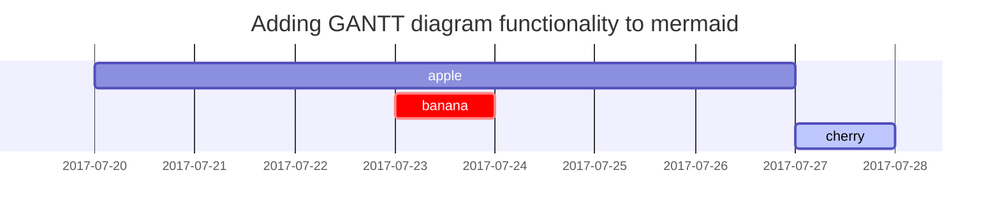

俗话说工欲善其事必先利其器，为了能更好的 Blogging 这里整理一下在使用的 `jekyll-theme-chirpy`​ 支持的 `Markdown` 语法。

## 标题

## H1 - heading

## H2 - heading

### H3 - heading

#### H4 - heading

```markdown
# H1 - heading
{: .mt-4 .mb-0 }

## H2 - heading
{: data-toc-skip='' .mt-4 .mb-0 }

### H3 - heading
{: data-toc-skip='' .mt-4 .mb-0 }

#### H4 - heading
{: data-toc-skip='' .mt-4 }
```

## 文章

Lorem ipsum dolor sit amet, consectetur adipiscing elit, sed do eiusmod tempor incididunt ut labore et dolore magna aliqua. Ut enim ad minim veniam, quis nostrud exercitation ullamco laboris nisi ut aliquip ex ea commodo consequat. Duis aute irure dolor in reprehenderit in voluptate velit esse cillum dolore eu fugiat nulla pariatur. Excepteur sint occaecat cupidatat non proident, sunt in culpa qui officia deserunt mollit anim id est laborum.

## 列表

### 有序列表

1. Firstly
2. Secondly
3. Thirdly

```markdown
1. Firstly
2. Secondly
3. Thirdly
```

### 无序列表

- Chapter

  - Section

    - Paragraph

```markdown
- Chapter
  + Section
    * Paragraph
```

### ToDo list

- Job

  - Step 1
  - Step 2
  - Step 3

```markdown
- [ ] Job
  + [x] Step 1
  + [x] Step 2
  + [ ] Step 3
```

### 说明列表

**Sun**

the star around which the earth orbits

**Moon**

the natural satellite of the earth, visible by reflected light from the sun

```markdown
Sun
: the star around which the earth orbits

Moon
: the natural satellite of the earth, visible by reflected light from the sun
```

## 引用块

> This line shows the ​*block quote*.

```markdown
> This line shows the _block quote_.
```

## 提示

> An example showing the `tip` type prompt.

> An example showing the `info` type prompt.

> An example showing the `warning` type prompt.

> An example showing the `danger` type prompt.

```markdown
> An example showing the `tip` type prompt.
{: .prompt-tip }

> An example showing the `info` type prompt.
{: .prompt-info }

> An example showing the `warning` type prompt.
{: .prompt-warning }

> An example showing the `danger` type prompt.
{: .prompt-danger }

```

## 表格

| **Company**                  | **Contact**      | **Country** |
| ---------------------------- | ---------------- | ----------- |
| Alfreds Futterkiste          | Maria Anders     | Germany     |
| Island Trading               | Helen Bennett    | UK          |
| Magazzini Alimentari Riuniti | Giovanni Rovelli | Italy       |

```markdown
| Company                      | Contact          | Country |
| :--------------------------- | :--------------- | ------: |
| Alfreds Futterkiste          | Maria Anders     | Germany |
| Island Trading               | Helen Bennett    |      UK |
| Magazzini Alimentari Riuniti | Giovanni Rovelli |   Italy |
```

## 链接

[https://www.bilibili.com/video/BV1GJ411x7h7/](https://www.bilibili.com/video/BV1GJ411x7h7/)

```markdown
<https://www.bilibili.com/video/BV1GJ411x7h7/>
```

## 脚注

Click the hook will locate the footnote​<sup>[1](https://blog.keepnaive233.network/posts/%E5%8D%9A%E5%AE%A2%E6%94%AF%E6%8C%81%E7%9A%84Markdown%E8%AF%AD%E6%B3%95/#fn:footnote)</sup>​, and here is another footnote​<sup>[2](https://blog.keepnaive233.network/posts/%E5%8D%9A%E5%AE%A2%E6%94%AF%E6%8C%81%E7%9A%84Markdown%E8%AF%AD%E6%B3%95/#fn:fn-nth-2)</sup>.

```markdown
Click the hook will locate the footnote[^footnote], and here is another footnote[^fn-nth-2].
```

## 内联代码

This is an example of `Inline Code`.

```markdown
This is an example of `Inline Code`.
```

## 文件路径

Here is the `/path/to/the/file.extend`.

```markdown
Here is the `/path/to/the/file.extend`{: .filepath}.
```

## 代码块

### 普通的代码块

```plaintext
This is a common code snippet, without syntax highlight and line number.
```

```markdown
```

This is a common code snippet, without syntax highlight and line number.

```
```

### 特定语言

```bash
if [ $? -ne 0 ]; then
  echo "The command was not successful.";
  #do the needful / exit
fi;
```

```markdown
‍```bash
if [ $? -ne 0 ]; then
  echo "The command was not successful.";
  #do the needful / exit
fi;
```

```


### 特定文件名

‍```sass highlighter-rouge
@import
  "colors/light-typography",
  "colors/dark-typography";
```

```markdown
‍```sass
@import
  "colors/light-typography",
  "colors/dark-typography";
```

```


## 数学表达式

由 <span data-type="a strong" data-href="https://www.mathjax.org/">MathJax</span> 支持的数学表达式

When , there are two solutions to  and they are

‍```markdown highlighter-rouge
$$ \sum_{n=1}^\infty 1/n^2 = \frac{\pi^2}{6} $$

When $a \ne 0$, there are two solutions to $ax^2 + bx + c = 0$ and they are

$$ x = {-b \pm \sqrt{b^2-4ac} \over 2a} $$
```

出于网站性能考虑，默认情况下不会加载数学功能。

```yaml
---
math: true
---
```

启用数学功能后，可以使用以下语法添加数学公式

- **数学公式块** 应使用 `$$ math $$`​ **必须** 在 `$$` 前后添加空行
- **内敛数学公式** (在行内) 必须添加 `$$ math $$`​ ，`$$` 前后不得有任何空行
- **内敛数学公式** (列表中) 必须添加 `\$$ math $$`

```markdown
<!-- Block math, keep all blank lines -->

$$
LaTeX_math_expression
$$

<!-- Inline math in lines, NO blank lines -->

"Lorem ipsum dolor sit amet, $$ LaTeX_math_expression $$ consectetur adipiscing elit."

<!-- Inline math in lists, escape the first `$` -->

1. \$$ LaTeX_math_expression $$
2. \$$ LaTeX_math_expression $$
3. \$$ LaTeX_math_expression $$
```

## Mermaid



<pre class="mermaid" data-processed="true"><svg aria-roledescription="gantt" role="graphics-document document" style="max-width: 792px;" viewBox="0 0 792 172" xmlns:xlink="http://www.w3.org/1999/xlink" xmlns="http://www.w3.org/2000/svg" width="100%" id="mermaid-1761527718585"><g></g><g text-anchor="middle" font-family="sans-serif" font-size="10" fill="none" transform="translate(75, 122)" class="grid"><path d="M0.5,-87V0.5H642.5V-87" stroke="currentColor" class="domain"></path><g transform="translate(54.5,0)" opacity="1" class="tick"><line y2="-87" stroke="currentColor"></line><text style="text-anchor: middle;" font-size="10" stroke="none" dy="1em" y="3" fill="#000">2017-07-21</text></g><g transform="translate(134.5,0)" opacity="1" class="tick"><line y2="-87" stroke="currentColor"></line><text style="text-anchor: middle;" font-size="10" stroke="none" dy="1em" y="3" fill="#000">2017-07-22</text></g><g transform="translate(214.5,0)" opacity="1" class="tick"><line y2="-87" stroke="currentColor"></line><text style="text-anchor: middle;" font-size="10" stroke="none" dy="1em" y="3" fill="#000">2017-07-23</text></g><g transform="translate(294.5,0)" opacity="1" class="tick"><line y2="-87" stroke="currentColor"></line><text style="text-anchor: middle;" font-size="10" stroke="none" dy="1em" y="3" fill="#000">2017-07-24</text></g><g transform="translate(375.5,0)" opacity="1" class="tick"><line y2="-87" stroke="currentColor"></line><text style="text-anchor: middle;" font-size="10" stroke="none" dy="1em" y="3" fill="#000">2017-07-25</text></g><g transform="translate(455.5,0)" opacity="1" class="tick"><line y2="-87" stroke="currentColor"></line><text style="text-anchor: middle;" font-size="10" stroke="none" dy="1em" y="3" fill="#000">2017-07-26</text></g><g transform="translate(535.5,0)" opacity="1" class="tick"><line y2="-87" stroke="currentColor"></line><text style="text-anchor: middle;" font-size="10" stroke="none" dy="1em" y="3" fill="#000">2017-07-27</text></g><g transform="translate(615.5,0)" opacity="1" class="tick"><line y2="-87" stroke="currentColor"></line><text style="text-anchor: middle;" font-size="10" stroke="none" dy="1em" y="3" fill="#000">2017-07-28</text></g></g><g><rect class="section section0" height="24" width="754.5" y="48" x="0"></rect><rect class="section section0" height="24" width="754.5" y="72" x="0"></rect><rect class="section section0" height="24" width="754.5" y="96" x="0"></rect></g><g><rect class="task task0" transform-origin="356px 60px" height="20" width="562" y="50" x="75" ry="3" rx="3" id="a"></rect><rect class="task crit0" transform-origin="356px 84px" height="20" width="80" y="74" x="316" ry="3" rx="3" id="b"></rect><rect class="task active0" transform-origin="677px 108px" height="20" width="80" y="98" x="637" ry="3" rx="3" id="c"></rect><text class="taskText taskText0  width-27.282974243164062" y="63.5" x="356" font-size="11" id="a-text">apple </text><text class="taskText taskText0  critText0 width-35.703155517578125" y="87.5" x="356" font-size="11" id="b-text">banana </text><text class="taskText taskText0 activeText0 width-32.00350570678711" y="111.5" x="677" font-size="11" id="c-text">cherry </text></g><g><text class="sectionTitle sectionTitle0" font-size="11" y="86" x="10" dy="0em"><tspan x="10" alignment-baseline="central"></tspan></text></g><g class="today"><line class="today" y2="147" y1="25" x2="242514" x1="242514"></line></g><text class="titleText" y="25" x="396"> Adding GANTT diagram functionality to mermaid</text></svg></pre>

```markdwon
‍```mermaid
 gantt
  title  Adding GANTT diagram functionality to mermaid
  apple :a, 2017-07-20, 1w
  banana :crit, b, 2017-07-23, 1d
  cherry :active, c, after b a, 1d
```

```

<span data-type="a strong" data-href="https://github.com/mermaid-js/mermaid">美人鱼</span> 是一款出色的图表生成工具，默认情况下不会加载。

‍```yaml highlighter-rouge
---
mermaid: true
---
```

## 图片

### 标题

在图片的下一行添加斜体，它将成为标题并显示在图片底部

 *全屏宽度和居中对齐*

```markdown
{: width="1165" height="1654" }
_全屏宽度和居中对齐_
```

### 大小

为了防止在加载图片时页面内容布局发生移动，应该为每张图片设置宽度和高度。

```markdown
{: width="1165" height="1654" }
_全屏宽度和居中对齐_
```

> 对于 SVG，至少要指定其宽度，否则将无法渲染。

### 左侧贴靠


```markdown
{: width="1165" height="1654" .w-75 .normal}
```

### 左侧浮动

 Lorem ipsum dolor sit amet, consectetur adipiscing elit. Etiam laoreet rhoncus massa. Aliquam ipsum lacus, cursus in orci ut, posuere ullamcorper magna. Quisque non libero facilisis, lacinia quam ultrices, dignissim leo. In consequat sollicitudin ante eu bibendum. Suspendisse potenti. Curabitur id enim accumsan, consequat ligula in, tempus nibh. Pellentesque quis mauris condimentum sapien faucibus egestas. Ut facilisis nisl sed ante varius posuere. Morbi aliquam imperdiet nunc nec commodo.

Pellentesque at mi in odio condimentum aliquet. Nullam in fermentum ipsum. Curabitur tempor tincidunt fringilla. Nulla eros est, rutrum nec dolor et, luctus auctor ipsum. Nam elementum, quam in tempus venenatis, ante odio facilisis eros, ac volutpat erat dui et nunc. Sed eu tortor malesuada justo gravida pulvinar nec sit amet tortor. Curabitur venenatis ullamcorper leo, eu dictum dolor egestas nec. Donec sed enim aliquet, ultricies libero at, suscipit libero. Donec aliquet vel tellus vel condimentum. Duis vitae dui diam. Quisque vitae lectus sed quam dapibus convallis. Praesent rutrum pretium efficitur. Fusce volutpat rhoncus augue at facilisis. Duis ac ante nulla. Nullam tempor ante ac elit lobortis, ac suscipit massa vestibulum.

```markdown
{: width="1165" height="1654" .w-50 .left}
Lorem ipsum dolor sit amet, consectetur adipiscing elit. Etiam laoreet rhoncus massa. Aliquam ipsum lacus, cursus in orci ut, posuere ullamcorper magna. Quisque non libero facilisis, lacinia quam ultrices, dignissim leo. In consequat sollicitudin ante eu bibendum. Suspendisse potenti. Curabitur id enim accumsan, consequat ligula in, tempus nibh. Pellentesque quis mauris condimentum sapien faucibus egestas. Ut facilisis nisl sed ante varius posuere. Morbi aliquam imperdiet nunc nec commodo.

Pellentesque at mi in odio condimentum aliquet. Nullam in fermentum ipsum. Curabitur tempor tincidunt fringilla. Nulla eros est, rutrum nec dolor et, luctus auctor ipsum. Nam elementum, quam in tempus venenatis, ante odio facilisis eros, ac volutpat erat dui et nunc. Sed eu tortor malesuada justo gravida pulvinar nec sit amet tortor. Curabitur venenatis ullamcorper leo, eu dictum dolor egestas nec. Donec sed enim aliquet, ultricies libero at, suscipit libero. Donec aliquet vel tellus vel condimentum. Duis vitae dui diam. Quisque vitae lectus sed quam dapibus convallis. Praesent rutrum pretium efficitur. Fusce volutpat rhoncus augue at facilisis. Duis ac ante nulla. Nullam tempor ante ac elit lobortis, ac suscipit massa vestibulum.
```

### 右侧浮动

 Lorem ipsum dolor sit amet, consectetur adipiscing elit. Etiam laoreet rhoncus massa. Aliquam ipsum lacus, cursus in orci ut, posuere ullamcorper magna. Quisque non libero facilisis, lacinia quam ultrices, dignissim leo. In consequat sollicitudin ante eu bibendum. Suspendisse potenti. Curabitur id enim accumsan, consequat ligula in, tempus nibh. Pellentesque quis mauris condimentum sapien faucibus egestas. Ut facilisis nisl sed ante varius posuere. Morbi aliquam imperdiet nunc nec commodo.

Pellentesque at mi in odio condimentum aliquet. Nullam in fermentum ipsum. Curabitur tempor tincidunt fringilla. Nulla eros est, rutrum nec dolor et, luctus auctor ipsum. Nam elementum, quam in tempus venenatis, ante odio facilisis eros, ac volutpat erat dui et nunc. Sed eu tortor malesuada justo gravida pulvinar nec sit amet tortor. Curabitur venenatis ullamcorper leo, eu dictum dolor egestas nec. Donec sed enim aliquet, ultricies libero at, suscipit libero. Donec aliquet vel tellus vel condimentum. Duis vitae dui diam. Quisque vitae lectus sed quam dapibus convallis. Praesent rutrum pretium efficitur. Fusce volutpat rhoncus augue at facilisis. Duis ac ante nulla. Nullam tempor ante ac elit lobortis, ac suscipit massa vestibulum.

```markdown
{: width="1165" height="1654" .w-50 .right}
Lorem ipsum dolor sit amet, consectetur adipiscing elit. Etiam laoreet rhoncus massa. Aliquam ipsum lacus, cursus in orci ut, posuere ullamcorper magna. Quisque non libero facilisis, lacinia quam ultrices, dignissim leo. In consequat sollicitudin ante eu bibendum. Suspendisse potenti. Curabitur id enim accumsan, consequat ligula in, tempus nibh. Pellentesque quis mauris condimentum sapien faucibus egestas. Ut facilisis nisl sed ante varius posuere. Morbi aliquam imperdiet nunc nec commodo.

Pellentesque at mi in odio condimentum aliquet. Nullam in fermentum ipsum. Curabitur tempor tincidunt fringilla. Nulla eros est, rutrum nec dolor et, luctus auctor ipsum. Nam elementum, quam in tempus venenatis, ante odio facilisis eros, ac volutpat erat dui et nunc. Sed eu tortor malesuada justo gravida pulvinar nec sit amet tortor. Curabitur venenatis ullamcorper leo, eu dictum dolor egestas nec. Donec sed enim aliquet, ultricies libero at, suscipit libero. Donec aliquet vel tellus vel condimentum. Duis vitae dui diam. Quisque vitae lectus sed quam dapibus convallis. Praesent rutrum pretium efficitur. Fusce volutpat rhoncus augue at facilisis. Duis ac ante nulla. Nullam tempor ante ac elit lobortis, ac suscipit massa vestibulum.
```

### 白天/夜间模式和阴影

您可以让图片在白天/夜间模式下遵循主题偏好。这需要准备两张图片，一张用于夜间模式，一张用于白天模式，然后为它们指定一个特定类别 (`dark`​ or `light`)，图片将根据主题偏好切换白天/夜间模式，注意它有阴影

 

```markdown
{: .light .w-75 .shadow .rounded-10 width="1165" height="1654" }
{: .dark .w-75 .shadow .rounded-10 width="1165" height="1654" }
```

## 视频

<iframe class="embed-video bilibili" loading="lazy" src="https://player.bilibili.com/player.html?bvid=BV1GJ411x7h7" scrolling="no" frameborder="no" framespacing="0" allowfullscreen="true"></iframe>

## 命名和路径

创建一个名为 `YYYY-MM-DD-TITLE.EXTENSION`​，并将其放在 `_posts`​ 目录下。注意，`EXTENSION`​ 必须是 `md`​ 或 `markdown`。如果想节省创建文件的时间，请考虑使用插件

​`Jekyll-Compose`

。

## 标头格式

基本上，您需要填写帖子顶部的 [Front Matter](https://jekyllrb.com/docs/front-matter/)，如下所示：

```yaml
---
title: TITLE
date: YYYY-MM-DD HH:MM:SS +/-TTTT
categories: [TOP_CATEGORIE, SUB_CATEGORIE]
tags: [TAG] # TAG names should always be lowercase
---
```

> 帖子的 *layout* 已默认设置为 `post`​，因此无需在 Front Matter 块中添加变量 ​*layout*。

### 时区

为了准确记录帖子的发布日期，不仅要设置 `_config.yml`​ 中的 `timezone`​ ，还要在 Front Matter 块的 `date`​ 变量中提供帖子的时区。格式：`+/-TTTT`​，如 `+0800`。

### 分类和标签

每个帖子的 “类别 “最多可包含两个元素，而 “标签 “中元素的数量可以是有很多。

```yaml
---
categories: [Animal, Insect]
tags: [bee]
---
```

### 作者信息

通常不需要在 *Front Matter* 中填写帖子的作者信息，默认情况下，它们将从配置文件中的变量 `social.name`​ 和 `social.links` 的第一个条目中获取。但你也可以按以下方式覆盖它：

在 `_data/authors.yml`中添加作者信息 (如果您的网站没有此文件，请立即创建一个)。

```yaml
<author_id>:
  name: <full name>
  twitter: <twitter_of_author>
  url: <homepage_of_author>
```

然后使用 `author`​ 指定单个条目，或使用 `authors` 指定多个条目：

```yaml
---
author: <author_id>                     # for single entry
# or
authors: [<author1_id>, <author2_id>]   # for multiple entries
---
```

不过，`author` 关键词也可以识别多个条目。

> 从 `_data/authors.yml`​ 文件读取作者信息的好处是，页面将带有元标签 [Twitter Cards](https://developer.twitter.com/en/docs/twitter-for-websites/cards/guides/getting-started#card-and-content-attribution)，这将丰富 Twitter Cards 并有利于 SEO。

## 目录

默认情况下，**T**able **o**f **C**ontents (TOC) 会显示在帖子的右侧面板上。如果想全局关闭，请转到 `_config.yml`​，将变量 `toc`​ 的值设置为 `false`​。如果要关闭特定文章的 TOC，请在文章的 [Front Matter](https://jekyllrb.com/docs/front-matter/)中添加以下内容：

```yaml
---
toc: false
---
```

## 评论

评论的全局开关由文件 `_config.yml`​中的变量 `comments.active` 定义。为该变量选择评论系统后，所有帖子的评论都将开启。

如果要关闭特定帖子的评论，请在帖子的**前部**添加以下内容：

```yaml
---
comments: false
---
```

## 图片路径

当一篇文章包含许多图片时，重复定义图片路径将是一项耗时的工作。为了解决这个问题，可以在帖子的 YAML 块中定义路径

```yml
---
img_path: /img/path/
---
```

然后，Markdown 的图像源可以直接写入文件名

```md

```

实际输出则会是

```html

```

## 图片预览

uuuuu

## 反向脚注

```markdown
[^footnote]: The footnote source
[^fn-nth-2]: The 2nd footnote source
```

1. The footnote source [↩](https://blog.keepnaive233.network/posts/%E5%8D%9A%E5%AE%A2%E6%94%AF%E6%8C%81%E7%9A%84Markdown%E8%AF%AD%E6%B3%95/#fnref:footnote)
2. The 2nd footnote source [↩](https://blog.keepnaive233.network/posts/%E5%8D%9A%E5%AE%A2%E6%94%AF%E6%8C%81%E7%9A%84Markdown%E8%AF%AD%E6%B3%95/#fnref:fn-nth-2)

[Blogging](https://blog.keepnaive233.network/categories/blogging/), [Markdown](https://blog.keepnaive233.network/categories/markdown/)

[Markdown](https://blog.keepnaive233.network/tags/markdown/)

本文由作者按照 [ CC BY 4.0 ](https://creativecommons.org/licenses/by/4.0/) 进行授权
